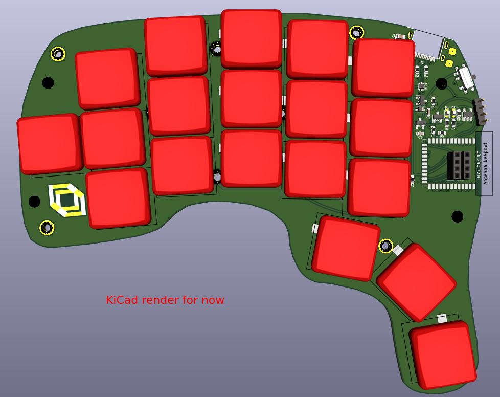

A wireless 38 key keyboard: a variation of the [Wubbo](https://github.com/cacheworks/Wubbo).

Neither one of the following works for this keyboard yet... we'll get there someday hopefully.
### [Interactive Bill of materials](https://cacheworks.github.io/Wubbo/)
### [Example ZMK config repo](https://github.com/mveerd/wubbo-zmk-config)

---
**NOTE:** The main PCB kicad files are where development is at now. No bottom or top plates and other things have been adapted yet.
